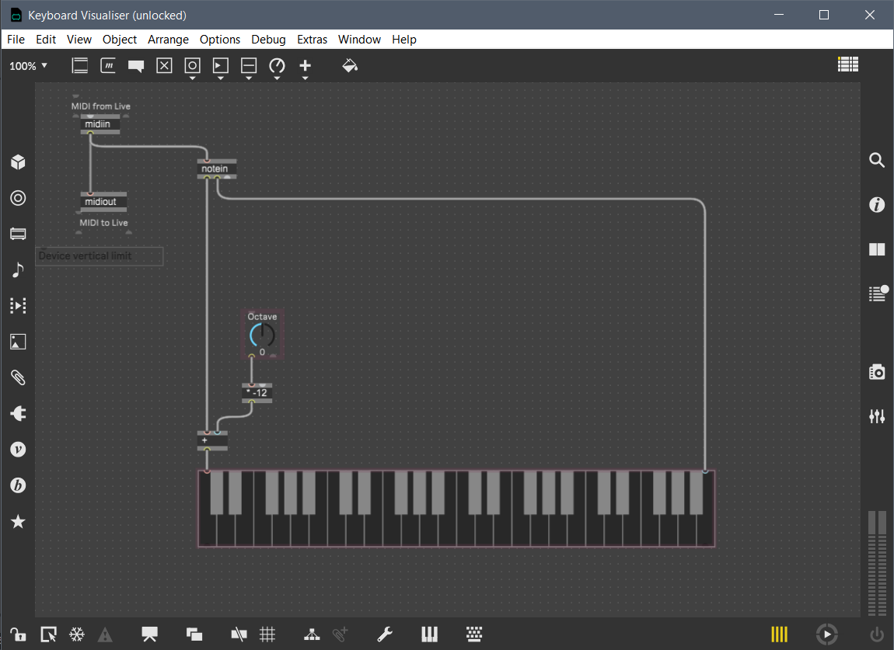

# Max for Live keyboard visualiser
A simple MIDI note keyboard visualiser for Ableton Live built using Max for Live 8.

At position 0 on the octave control the visualiser will show notes C1 to B4. Each step on the octave control adjusts this in 12 semitone increments, for a total range of C-2 to B7.

## How to install
1. Download "Keyboard Visualiser.amxd"
2. Start Ableton Live
3. Drag "Keyboard Visualiser.amxd" onto a MIDI track
4. Click on the device's save button to save it to your user library

## Editing the Max patch
1. Open the Max device for editing
2. Unfreeze (snowflake icon in bottom-left corner)
3. Exit presentation mode (View > Presentation)
4. Make sure editing is enabled (View > Edit)

